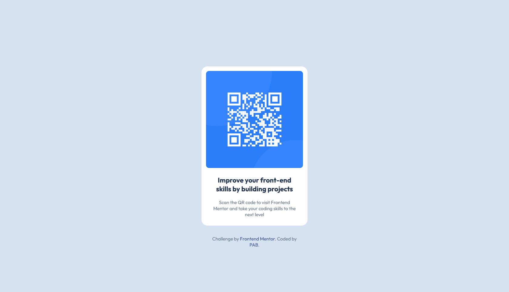

# Frontend Mentor - QR code component solution

This is a solution to the [QR code component challenge on Frontend Mentor](https://www.frontendmentor.io/challenges/qr-code-component-iux_sIO_H). Frontend Mentor challenges help you improve your coding skills by building realistic projects.

## Table of contents

- [Overview](#overview)
  - [Screenshot](#screenshot)
  - [Links](#links)
- [My process](#my-process)

  - [Built with](#built-with)

- [Author](#author)
- [Acknowledgments](#acknowledgments)

## Overview

### Screenshot

### Links

- Solution URL: [Netlify]([https://your-solution-url.com](https://sage-elf-c65a5b.netlify.app))
- Live Site URL: [Frontend io]([https://your-live-site-url.com](https://www.frontendmentor.io/solutions/qr-code-component-using-html-and-css-91Nt6lZP5J))

## My process

### Built with

- Semantic HTML5 markup
- CSS custom properties
- Flexbox
- CSS Grid

## Author

- Frontend Mentor - [@pabjunior](https://www.frontendmentor.io/profile/pabjunior)
- Twitter - [@PAB_Junior](https://www.twitter.com/PAB_Junior)

## Acknowledgments

I wanted to take a moment to express my gratitude for the valuable resources and challenges you provide (Frontend Mentor). This is another project completed, and it was an excellent opportunity for me to apply what I've learned in a practical context.

Your platform has been instrumental in helping me grow as a developer, and I appreciate the thought and effort you put into creating these challenges. The experience has been both rewarding and insightful.

Thank you for the work you do in supporting developers like myself in our journey to improve and succeed.
