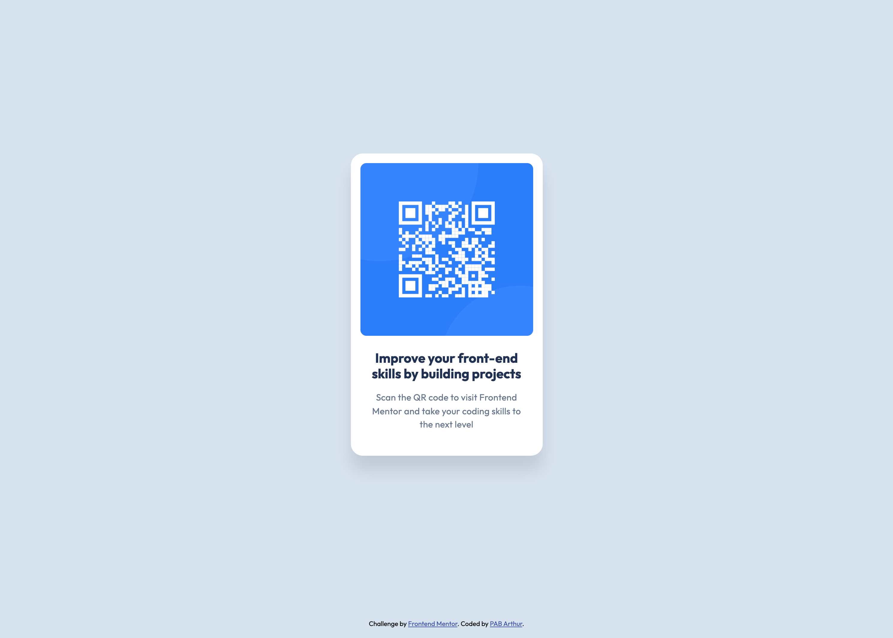

# Frontend Mentor - QR code component solution

This is my solution to the [QR code component challenge on Frontend Mentor](https://www.frontendmentor.io/challenges/qr-code-component-iux_sIO_H). Frontend Mentor challenges help you improve your coding skills by building realistic projects.

## Table of contents

- [Overview](#overview)
  - [Screenshot](#screenshot)
  - [Links](#links)
- [My process](#my-process)
  - [Built with](#built-with)
  - [What I learned](#what-i-learned)
  - [Continued development](#continued-development)
  - [Useful resources](#useful-resources)
  - [AI Collaboration](#ai-collaboration)
- [Author](#author)

## Overview

### Screenshot

### Links

- Solution URL: [QR Code page repo](https://github.com/pabjunior/qr-code-component)
- Live Site URL: [QR Code page live site](https://pabjunior.github.io/qr-code-component/)

## My process

### Built with

- Semantic HTML5 markup
- CSS custom properties
- Flexbox
- Mobile-first workflow
- Google Fonts

### What I learned

This project helped me practice:

- using semantic elements like `main`, `article`, and `footer`
- centering a card with Flexbox
- writing clearer alt text for the QR code image
- keeping spacing and layout close to a provided design

### Continued development

Things I want to keep practicing:

- stronger CSS layout control
- cleaner spacing between elements
- better understanding of semantic HTML
- making designs match more closely across screen sizes

### Useful resources

- [Frontend Mentor](https://www.frontendmentor.io) - The challenge itself and the design reference.

### AI Collaboration

I used AI to help me:

- inspect the project files
- check the HTML and CSS structure
- compare the build against the design
- make small accessibility and semantic improvements

The AI was most useful for checking my work and pointing out small layout or accessibility improvements. I still made the actual changes and learned from the process.

## Author

- Frontend Mentor - [Frontend Mentor Profile](https://www.frontendmentor.io/profile/pabjunior)
- Github - [Github Profile](https://www.github.com/pabjunior)
